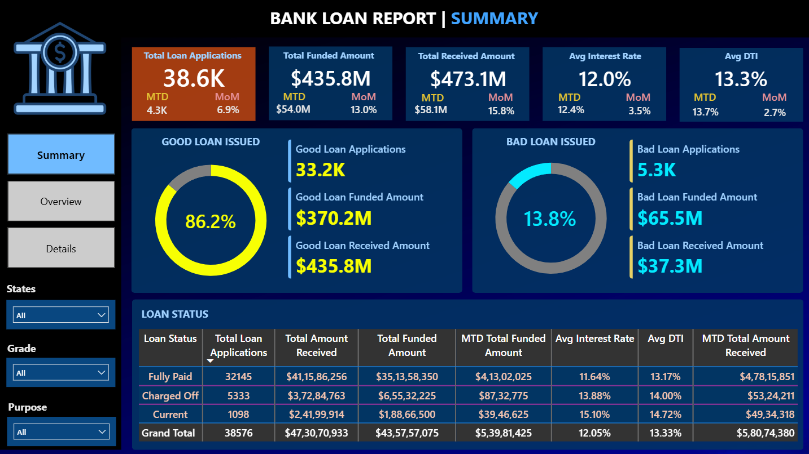
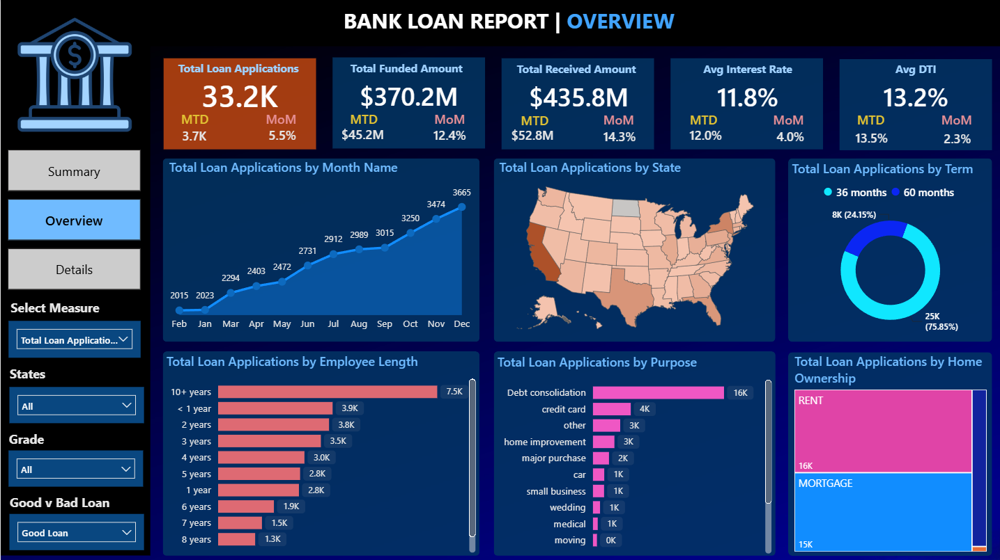
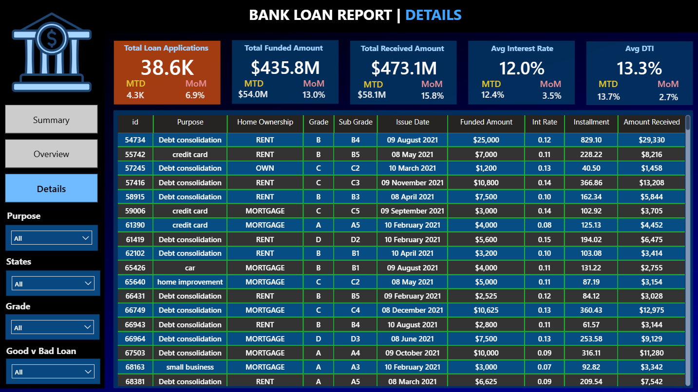

# 🏦 Bank Loan Analysis Dashboard

An end-to-end **MySQL + Power BI** project built as part of the **SyntecxHub Data Analysis Internship Program**.

---

## 📌 Project Overview

This project analyzes a bank's loan portfolio (38,576 loan applications issued in 2021) to understand how much money was lent, how much came back, and which loans turned out good or bad. KPIs were first validated using SQL queries in MySQL, then rebuilt as an interactive 3-page Power BI dashboard.

---

## 🎯 Objectives (as per project brief)

- Analyze bank loan data (applications, funded amount, repayments)
- Calculate KPIs like total applications, funded and received amounts
- Classify loans into good vs bad loans
- Perform trend analysis by time, region, and customers
- Identify factors affecting approval and repayment
- Build a Power BI dashboard for insights

---

## 📁 Dataset

**Source table:** `financial_loan` (MySQL database `bank_loan_analysis`)  
**Rows:** 38,576 loan records · **Period:** Jan 2021 – Dec 2021

Key columns: `id`, `issue_date`, `loan_status`, `loan_amount`, `total_payment`, `int_rate`, `dti`, `grade`, `term`, `purpose`, `emp_length`, `home_ownership`, `address_state`.

---

## 🛠️ Tools Used

- **MySQL** — KPI validation and summary queries
- **Power BI Desktop** — data model, DAX, visuals
- **Power Query (M)** — date type conversion (`dd-mm-yyyy`)
- **DAX** — MTD / PMTD / MoM measures, good vs bad loan logic

---

## 🧠 Good Loan vs Bad Loan

| Category | `loan_status` values | Applications | Share |
|---|---|---|---|
| **Good Loan** | Fully Paid, Current | 33,243 | 86.2% |
| **Bad Loan** | Charged Off | 5,333 | 13.8% |

Implemented as a calculated column in Power BI:

```dax
Good v Bad Loan =
SWITCH(
    TRUE(),
    ISBLANK([loan_status]), "(Blank)",
    [loan_status] IN {"Charged Off"}, "Bad Loan",
    [loan_status] IN {"Current", "Fully Paid"}, "Good Loan",
    [loan_status]
)
```

---

## 📈 Dashboard Pages

### 1. Summary
- KPI cards with MTD and MoM: Total Loan Applications, Total Funded Amount, Total Amount Received, Avg Interest Rate, Avg DTI
- Good Loan vs Bad Loan donuts with applications, funded amount and received amount
- Loan Status grid summary
- Slicers: State, Grade, Purpose

### 2. Overview
- Total Amount Received by Month (trend)
- Total Amount Received by State (map)
- Total Amount Received by Term, Employee Length, Purpose and Home Ownership
- "Select Measure" slicer to switch the measure shown on the charts

### 3. Details
- Loan-level table (purpose, home ownership, grade, sub-grade, issue date, funded amount, interest rate, installment, amount received)

---

## 📐 Key DAX Measures

```dax
MoM Total Amount Received =
DIVIDE(
    [MTD Total Amount Received] - [PMTD Total Amount Received],
    [PMTD Total Amount Received]
)
```

```dax
Bad Loan % =
CALCULATE([Total Loan Applications], [Good v Bad Loan] = "Bad Loan") / [Total Loan Applications]
```

MTD values use `TOTALMTD`, and PMTD values use `DATESMTD(DATEADD(Date, -1, MONTH))` on a dedicated Date Table.

---

## 🗃️ SQL Query Document

All KPIs, good vs bad loan metrics, loan status summaries and overview breakdowns (month, state, term, employee length, purpose, home ownership) were first written and validated in MySQL. See `Bank_Loan_Report_Query_Document_Colorful.docx`. The SQL results match the Power BI numbers exactly.

---

## 🖼️ Dashboard Preview





---

## 🔍 Key Insights

- **Portfolio size:** 38.6K applications, **$435.8M funded**, **$473.1M received** (about 108.6% of the funded amount)
- **Good vs bad:** 86.2% of loans are good, 13.8% are charged off. Bad loans were funded with $65.5M but only $37.3M came back
- **Risk rises sharply with grade:** bad loan rate goes from **5.7% (Grade A)** to **31.3% (Grade G)**
- **Term matters:** 60-month loans have a **22.3%** bad loan rate vs **10.7%** for 36-month loans
- **Purpose:** small business loans are the riskiest (25.6% bad), while debt consolidation is the largest by volume ($253.8M received)
- **Pricing:** bad loans carry a higher average interest rate (13.9%) than good loans (11.8%)
- **Geography:** California leads with $83.9M received, followed by New York and Texas
- **December (MTD):** 4,314 applications (+6.9% MoM), $54.0M funded (+13.0%), $58.1M received (+15.8%)
- **Trend:** monthly amount received grew from about $28M in January to $58M in December

---

## ⚠️ Data Notes

- Dates are stored as text in `dd-mm-yyyy` format and converted using the `en-GB` culture in Power Query. SQL and Power BI month totals match.
- December data ends on **12 Dec 2021**, so December "MTD" figures cover a partial month.
- Some date columns in the source data are internally inconsistent (for example `last_payment_date` earlier than `issue_date` for many rows). Because of this, the analysis is done at **month level**, not day level.

---

## 📂 Files in this Repository

| File | Description |
|---|---|
| `Bank_Loan_Analysis_Dashboard.pbix` | Power BI dashboard |
| `Bank_Loan_Report_Query_Document.docx` | SQL queries and outputs for all KPIs |
| `financial_loan.csv` | Raw dataset |
| `Summary.png`, `Overview.png`, `Details.png` | Dashboard screenshots |
| `README.md` | Project documentation |

---

## 🙋 About

Built by **Satyam Kumar Singh** as part of the **SyntecxHub Internship Program** (Data Analysis Track).

🔗 [LinkedIn](https://www.linkedin.com/in/satyam-kumar-singhh)  
🌐 [SyntecxHub](https://www.syntecxhub.com)
